# ft_transcendence

`ft_transcendence` est une application web temps réel autour d'un Pong 3D, développée en TypeScript avec une architecture microservices. Le projet combine authentification JWT, 2FA, OAuth Google/42, jeu WebSocket, matchmaking, tournois, profils, statistiques, chat social et reverse proxy HTTPS.

Le projet est conçu pour être lancé rapidement avec :

```bash
make
```

## Aperçu du projet

| Menu principal | Gameplay temps réel |
| --- | --- |
| 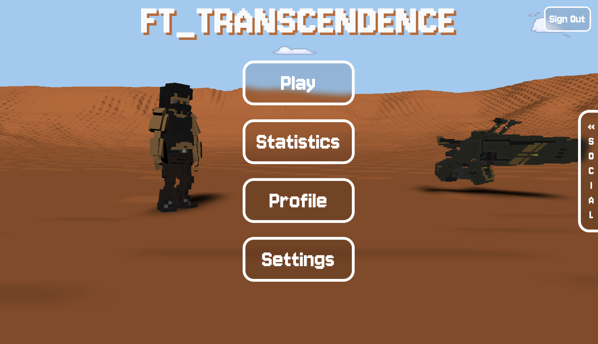 | 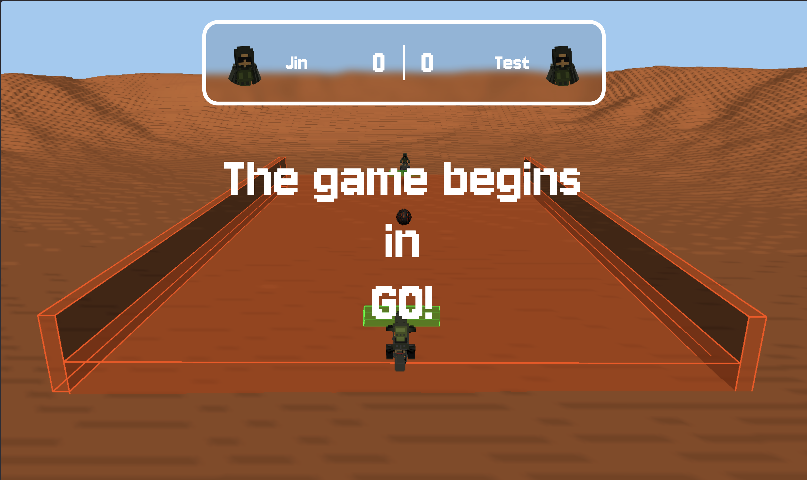 |

| Paramètres | Profil et statistiques |
| --- | --- |
| 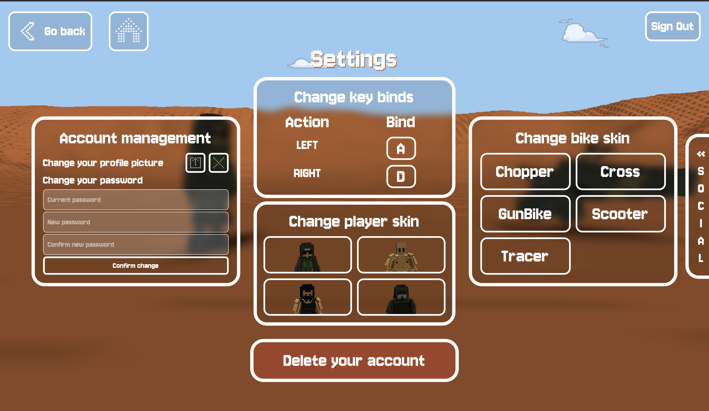 | 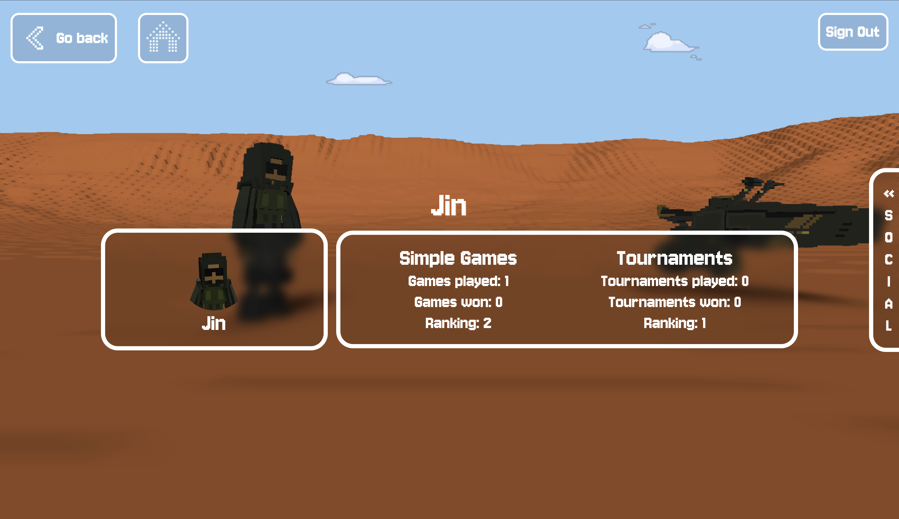 |

| Victoire |
| --- |
| 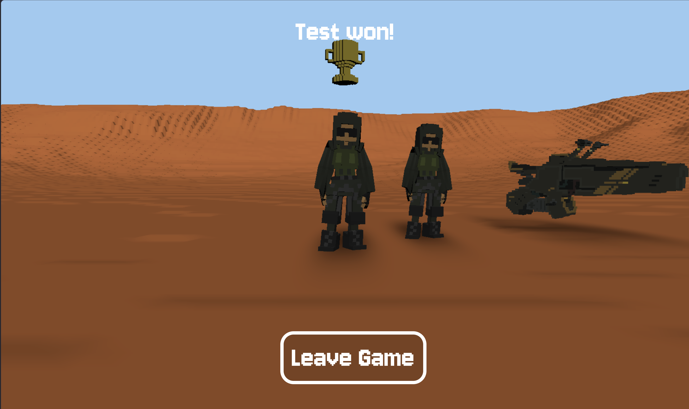 |

## Démarrage rapide

```bash
make help        # affiche la bannière, les couleurs et les commandes
make env         # génère un .env local-demo
make check-env   # vérifie le .env et annonce les fonctions indisponibles
make up          # build et lance toute la stack Docker
```

Une fois lancé :

```text
https://localhost:8443
```

Le certificat HTTPS est auto-signé en local, il faut donc l'accepter dans le navigateur.

## Mode local-demo sans `.env` officiel

Le Makefile génère un `.env` utilisable pour lancer le projet localement, mais ce n'est pas un `.env` officiel avec de vrais secrets externes. Les secrets internes sont générés localement, tandis que les clés OAuth restent volontairement en placeholders.

Fonctionnalités indisponibles tant que les vraies clés ne sont pas renseignées :

- Connexion Google.
- Connexion 42.
- Validation réelle des callbacks OAuth Google/42.

Le reste de la stack peut être présenté : interface, jeu, WebSocket, profils, statistiques, chat, matchmaking et tournois selon les données locales.

## Stack technique

| Couche | Technologies | Fichiers principaux |
| --- | --- | --- |
| Frontend | Vite, TypeScript, BabylonJS | `frontend/src/main.ts`, `frontend/src/classes/Game.ts`, `frontend/src/classes/Network.ts` |
| Reverse proxy | Nginx, HTTPS, WebSocket proxy | `nginx/nginx.conf` |
| API Gateway | Fastify, cookies, JWT, proxy HTTP | `gateway/server.ts` |
| Auth | Fastify, SQLite, JWT, 2FA, OAuth | `auth-service/src/auth.routes.ts`, `auth-service/src/externalServicesAuth.ts` |
| Users | Fastify, SQLite, avatars, stats | `user-service/src/user-routes.ts`, `user-service/src/db.ts` |
| Chat | Fastify WebSocket, friendships, blocks | `chat-service/src/route.ts`, `chat-service/src/webSocketHandler.ts` |
| Matchmaking | Fastify, SQLite, games, tournaments | `matchmaking-service/src/matchmaking-routes.ts`, `matchmaking-service/src/db.ts` |
| Game server | Node WebSocket, rooms, physics | `server/src/server.ts`, `server/src/Rooms.ts`, `server/src/Room.ts`, `server/src/Gamelogic.ts` |

## Architecture globale

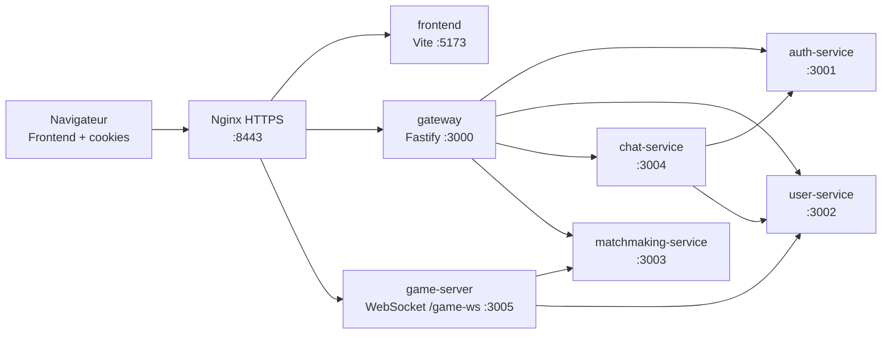

Ce schéma vient directement de `docker-compose.yml`, `nginx/nginx.conf` et `gateway/server.ts`.

## Routage et sécurité HTTP

Le gateway centralise la sécurité applicative. Il lit le cookie `access_token`, vérifie le JWT avec `JWT_SECRET`, ajoute `x-user-id` et `x-username`, puis proxifie vers le service concerné.

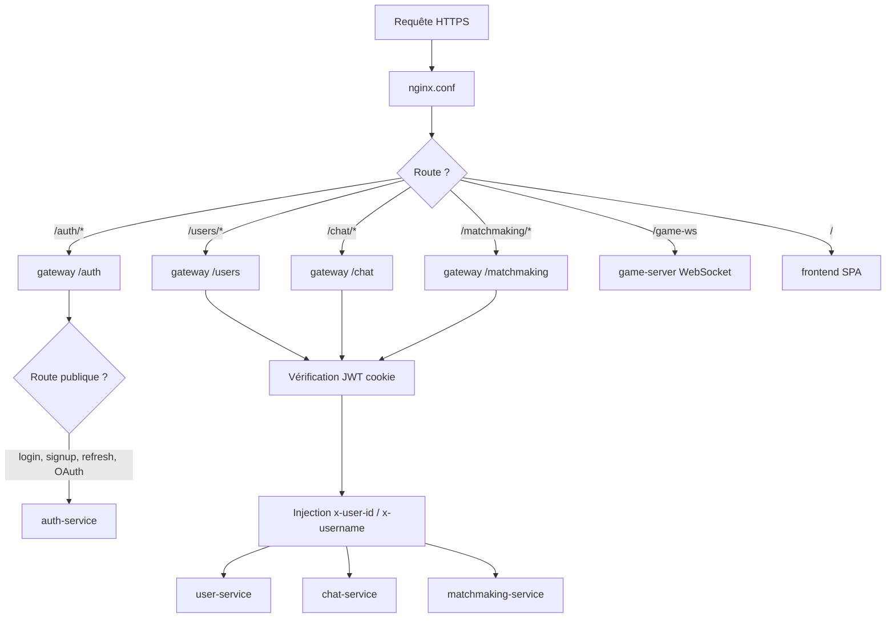

Routes publiques définies dans `gateway/server.ts` :

- `/auth/login`
- `/auth/signup`
- `/auth/refresh`
- `/auth/google`
- `/auth/google/callback`
- `/auth/42`
- `/auth/42/callback`
- `/auth/providers`
- `/health`

Préfixes protégés par JWT :

- `/users`
- `/game`
- `/chat`
- `/matchmaking`

## Authentification

Le service d'authentification gère signup, login, 2FA, refresh token, logout, statut de session, changement de mot de passe, suppression de compte et OAuth.

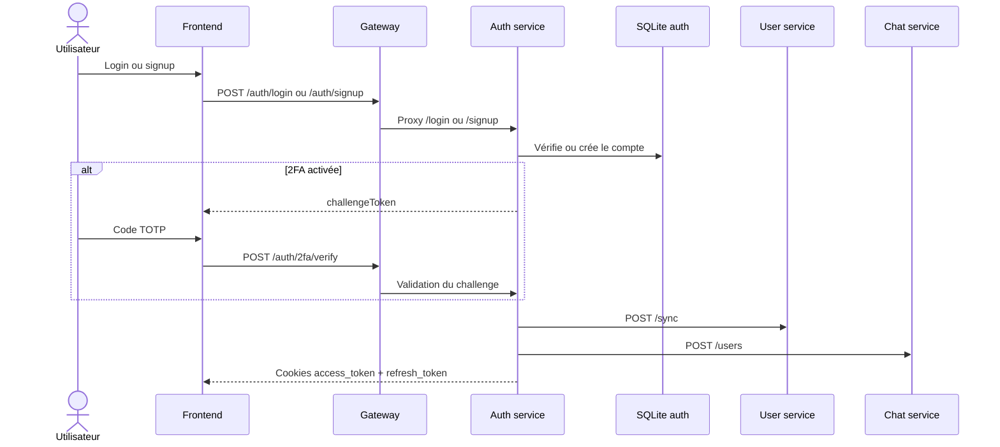

Flux OAuth dans `auth-service/src/externalServicesAuth.ts` :

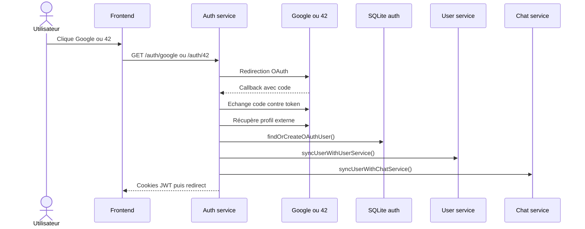

## Jeu simple en WebSocket

Le frontend ouvre `/game-ws` via `frontend/src/main.ts`, puis envoie des messages gérés par `server/src/server.ts`. Le serveur crée ou rejoint une `Room`, persiste l'état de matchmaking, attend que les deux joueurs soient prêts, puis démarre `Gamelogic`.

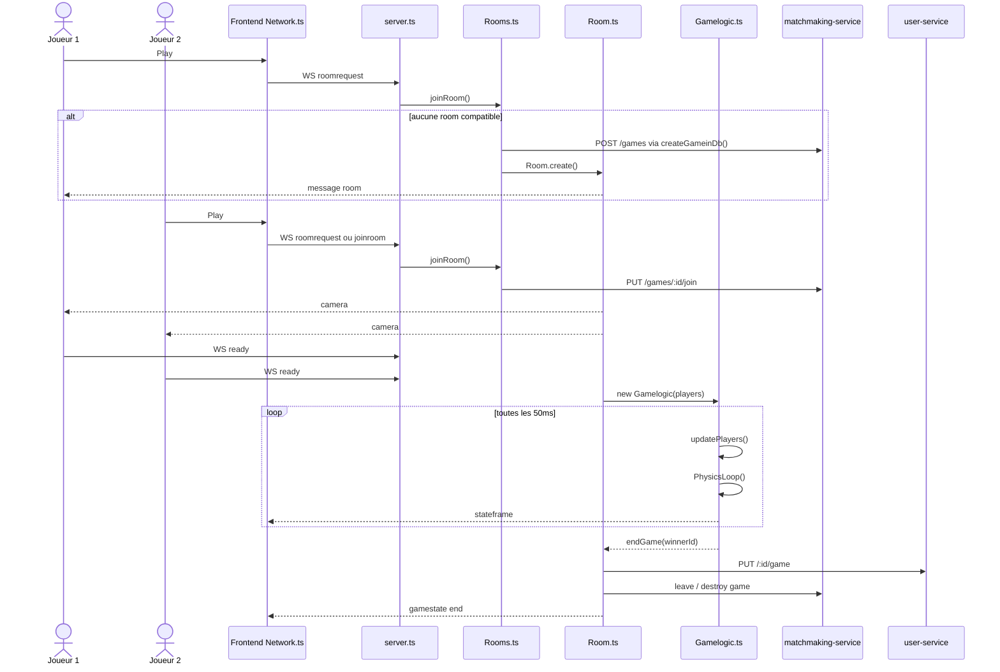

Messages WebSocket principaux côté jeu :

| Message | Origine | Fonction appelée |
| --- | --- | --- |
| `roomrequest` | Frontend | `Server.handleClientMessage()` puis `Rooms.joinRoom()` ou `Rooms.createRoom()` |
| `joinroom` | Frontend | `Rooms.joinRoom(player, false, roomid)` |
| `directconnection` | Frontend | `Rooms.directconnection()` ou `Tournament.directConnection()` |
| `ready` | Frontend | `Rooms.setPlayerReady()` ou `Tournament.setPlayerReady()` |
| `leavegame` | Frontend | `Rooms.leaveRoom()` |
| `stateframe` | Serveur | envoyé par `Gamelogic.broadcastplayers()` |
| `score` | Serveur | callback `setUpdateScoreCallback()` |
| `gamestate end` | Serveur | envoyé par `Rooms.sendEndGameToPlayers()` |

## Tournois

Le tournoi est piloté côté game-server par `Tournament.ts` et persiste son état dans `matchmaking-service`. Les rounds sont représentés par des `Rooms`, et le bracket est sauvegardé sous forme JSON.

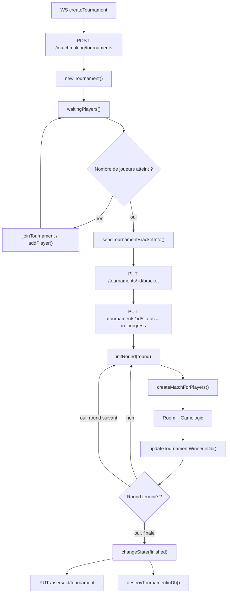

Gestion des déconnexions en tournoi :

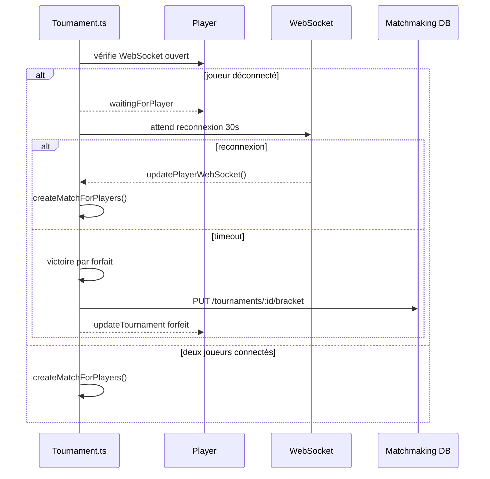

## Chat et social

Le chat combine une API HTTP pour amis/blocages et un WebSocket pour les messages et invitations. Le WebSocket `/chat/ws` vérifie le JWT depuis les cookies, connecte l'utilisateur dans `ConnectionManager`, puis `webSocketHandler.ts` applique les règles métier.

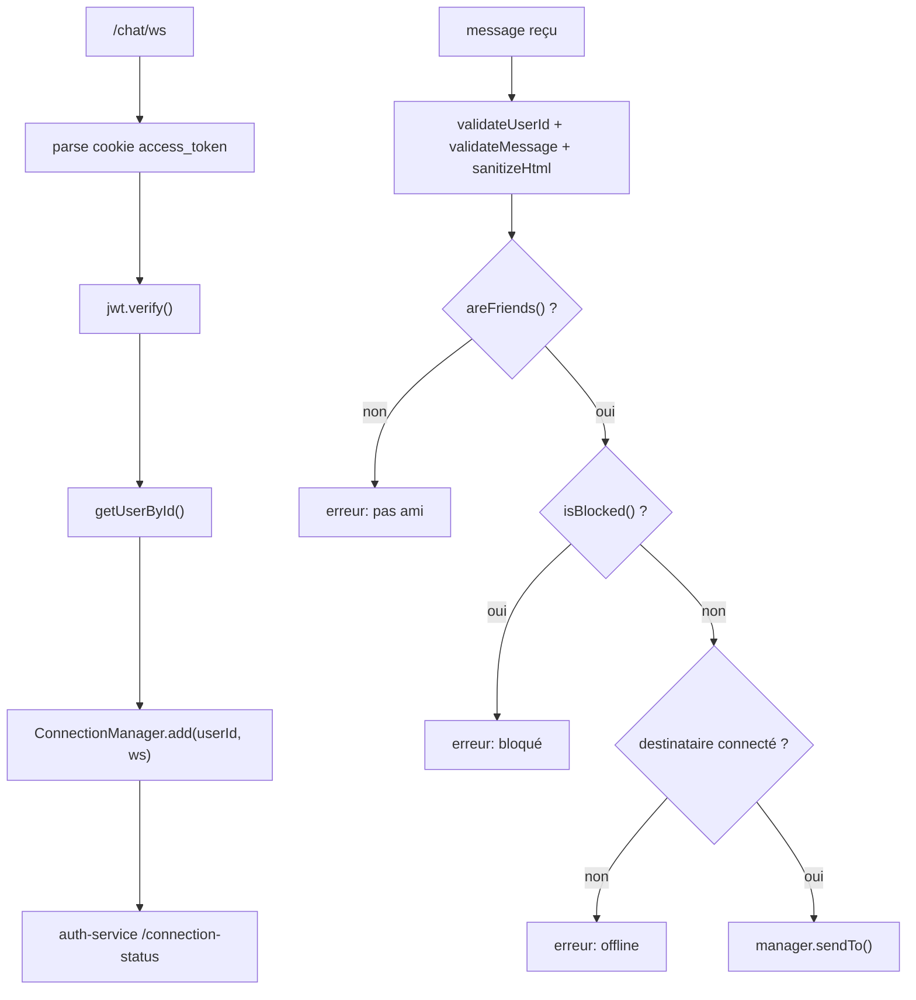

Routes sociales principales dans `chat-service/src/route.ts` :

| Route | Fonction |
| --- | --- |
| `POST /chat/users` | synchronise un utilisateur créé côté auth |
| `GET /chat/search` | recherche un utilisateur via `user-service` |
| `POST /chat/friends` | crée une invitation |
| `GET /chat/friends` | liste les amis acceptés |
| `PUT /chat/friends/:id_friendship` | accepte ou refuse une invitation |
| `DELETE /chat/friends/:friend` | supprime une relation |
| `POST /chat/block` | bloque un utilisateur |
| `DELETE /chat/block/:blocked_id` | débloque un utilisateur |
| `GET /chat/ws` | WebSocket messages, invitations jeu/tournoi |

## Profils, statistiques et avatars

Le `user-service` maintient l'état public du joueur : avatar, skin de moto, statistiques, keybinds, game/tournament courant et photo de profil. Les routes utilisent `x-user-id` injecté par le gateway.

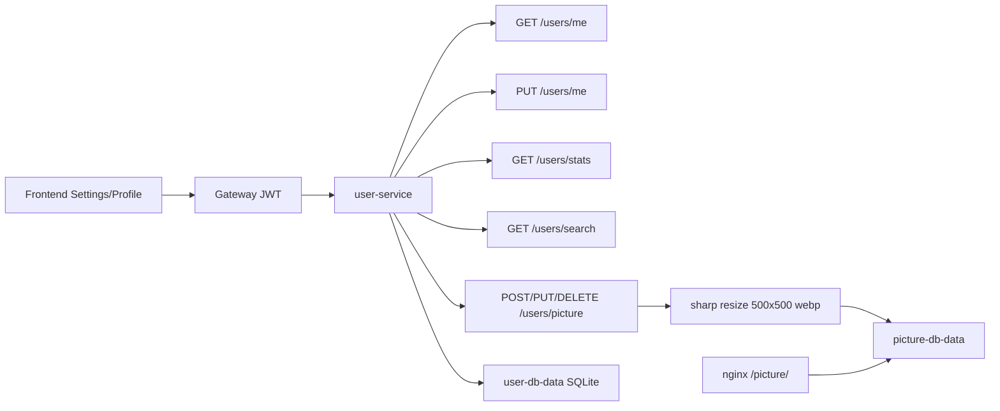

## Persistance

Chaque service garde son propre stockage. Cette séparation rend les responsabilités plus claires : identité, profil, social et matchmaking ne sont pas mélangés.

```mermaid
erDiagram
    AUTH_USERS {
        integer id PK
        text username
        text hashedPassword
        text email
        text twofa_secret
        integer twofa
        text oauth_provider
        text oauth_id
        integer is_connected
    }

    USER_USERS {
        integer id PK
        text username
        integer avatar
        integer bike
        integer gamesPlayed
        integer gamesWon
        integer tournamentPlayed
        integer tournamentWon
        text left
        text right
        integer currentGameID
        integer currentTournamentID
        text profilePicture
    }

    CHAT_USERS {
        integer id PK
    }

    FRIENDSHIPS {
        integer id PK
        integer user1_id FK
        integer user2_id FK
        integer sender
        text status
    }

    BLOCKS {
        integer id PK
        integer blocker_id FK
        integer blocked_id FK
    }

    GAMES {
        integer id PK
        integer powerups
        text player1
        text player2
        integer tournamentId
    }

    TOURNAMENTS {
        integer id PK
        integer maxPlayers
        integer powerUps
        text status
        integer currentRound
        integer winnerId
        text bracket
        text players
        integer creator
    }

    CHAT_USERS ||--o{ FRIENDSHIPS : friendship
    CHAT_USERS ||--o{ BLOCKS : block
    TOURNAMENTS ||--o{ GAMES : tournament_games
```

## Organisation du code

```text
ft_transcendence/
├── auth-service/          # login, signup, JWT, 2FA, OAuth
├── user-service/          # profils, stats, avatars, keybinds
├── chat-service/          # amis, blocages, messages WebSocket
├── matchmaking-service/   # games, tournaments, bracket SQLite
├── gateway/               # API Gateway, auth hook, proxy Fastify
├── frontend/              # Vite + TypeScript + BabylonJS
├── server/                # serveur WebSocket du jeu, rooms, physics
├── nginx/                 # reverse proxy HTTPS
├── scripts/               # génération du .env local-demo
├── docs/images/           # captures du projet
└── docker-compose.yml     # orchestration des services
```

## Commandes utiles

| Commande | Usage |
| --- | --- |
| `make` ou `make up` | génère `.env`, build et lance les conteneurs |
| `make env` | génère ou rafraîchit le `.env local-demo` |
| `make check-env` | vérifie le `.env` et affiche les fonctions désactivées |
| `make up-attached` | lance la stack avec les logs attachés |
| `make logs` | suit les logs de tous les services |
| `make ps` | liste les conteneurs |
| `make down` | arrête les conteneurs |
| `make fclean` | supprime conteneurs, images et volumes |

## Points forts à expliquer

- Architecture microservices avec responsabilités séparées.
- Gateway Fastify qui centralise JWT, cookies, CORS, rate limit et proxy.
- Jeu WebSocket avec rooms, reconnexion, ready state, score et boucle physique.
- Tournois persistés avec bracket JSON, rounds successifs et gestion des forfaits.
- Chat social avec amis, blocages, invitations et statut de connexion.
- Lancement simplifié par Makefile, `.env local-demo` et certificats HTTPS locaux.

## Limites connues du mode demo

Sans `.env` officiel, les clés OAuth sont des placeholders. Le projet affiche donc clairement que Google/42 sont indisponibles jusqu'à configuration de vraies clés. Pour une démonstration complète, remplacer dans `.env` :

```text
GOOGLE_CLIENT_ID
GOOGLE_CLIENT_SECRET
FORTYTWO_CLIENT_ID
FORTYTWO_CLIENT_SECRET
```
Projet 42 - ft_transcendence
